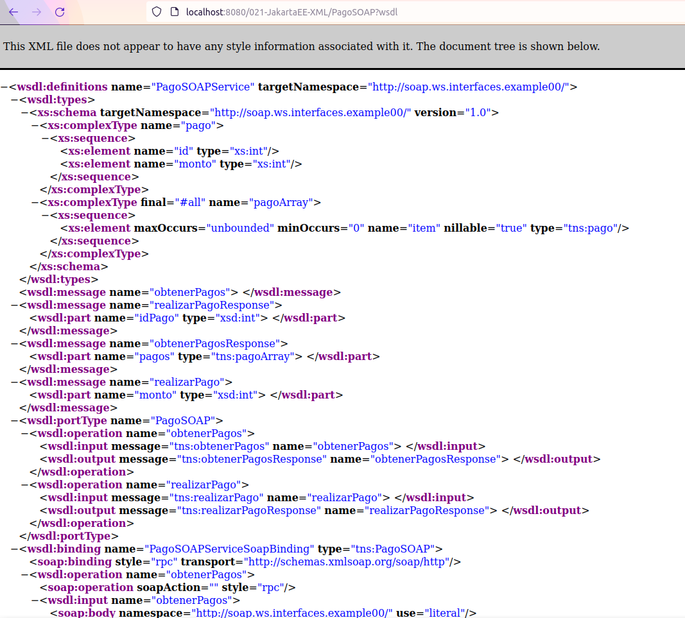
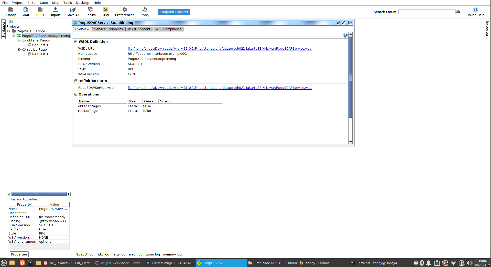

# Web Services
"1. Descargue proyecto (02-JakartaEE-XML) donde está implementado el web service visto en clases. Provisione el servidor, deploye el código y analice los logs del servidor en busca de la url del wsdl asociado al servicio."

Tras haber descargado el práctico del [repositorio del profe](https://github.com/gabrielaramburu/TallerJakartaEE) me dispongo a correr el servidor y API proporcionada por el profe, para esto tuve que tirar:
```Bash
mvn install wildfly:dev
```
en la carpeta de proyecto: *021-JakartaEE-XML* porqué el servidor que tengo configurado en mi Eclipse no estába levantando bien la API, tras esto me dirijo a la dirección del *wsdl*
 que me indica el servidor cuando lo levanto.
 
Este mismo se encuentra en http://localhost:8080/021-JakartaEE-XML/PagoSOAP?wsdl como índica la imagen arriba

---
"3) Instale aplicación SoapUI (client web service), realice y ejecute, una batería de test unitarios de dicho servicio. Analice los datos devueltos."

Se hace la instalación del SoapUI para linux



Se obtienen los pagos utilizando SoapUI:
![[../Archivos/image-3-20240414201926.png]]


Se realiza un pago nuevo:
![[../Archivos/image-4-20240414201926.png]]


Y se vuelve a revisar los pagos:
![[../Archivos/image-5-20240414201926.png]]
Se puede observar como el pago 3 es el que se acaba de realizar utilizando soapUI


# RESTful
"1. Descargue proyecto donde está implementado el servicio RESTful (02-JakartaRESTful). Provisione el servidor y deploye el código."

Se descarga el repositorio y despliega la API RESTful proporcionada utilizando el servidor WildFly previamente configurado en Eclipse. Tras esto se ejecutan los test unitarios.

Test unitario de RESTful número 1:
![[../Archivos/image-6-20240414201926.png]]

Test unitario de RESTful número 2:
![[../Archivos/image-7-20240414201926.png]]


Además de los test provistos, se hace uso de curl para probar el correcto funcionamiento de la API:

- utilizando cliente RESTful:
![[../Archivos/image-8-20240414201926.png]]

- utilizando cliente RCP:
![[../Archivos/image-9-20240414201926.png]]

---

"07) Instale aplicación Postman y cree una test unitario que para invocar los servicios RESTful"

Utilizando Postman se prueban los servicios provistos por la API RESTful:
![[../Archivos/image-10-20240414201926.png]]

y ahora para el cliente RCP:
![[../Archivos/image-11-20240414201926.png]]

---

"10)  Modifique la API RESTful para que ofrezca un método que dado un nombre de un cliente, devuelve si existe o no."

Se implementa la función (código se encuentra en este repositorio con su respectivo test unitario) y se prueba la misma con el cliente RESTful:
![[../Archivos/image-12-20240414201926.png]]

Cuando el cliente si existe:
![[../Archivos/image-13-20240414201926.png]]


Se vuelve a checkear la funcionalidad, esta vez con cliente RPC:
![[../Archivos/image-14-20240414201926.png]]


Cuando el cliente si existe:
![[../Archivos/image-15-20240414201926.png]]


# Swagger
"2) Lanze el servidor y verifique que la ulr [http://localhost:8080/02_jakartaRESTful_swagger/api/openapi.json](http://localhost:8080/02_jakartaRESTful_swagger/api/openapi.json) devuelve información sobre los servicios deployados."

Se descarga y deploya el repositorio "02-JakartaEE-RESTful-Swagger" utilizando 
```Bash
mvn install wildfly:dev
```
tras esto se verifica la URL proporcionada por OpenAPI:
![[../Archivos/image-16-20240414201926.png]]

---

"1. Invoque la página de documentación de swagger: [http://localhost:8080/02_jakartaRESTful_swagger/swagger.html](http://localhost:8080/02_jakartaRESTful_swagger/swagger.html)"

También se prueba la URL en donde OpenAPI prepara una página detallando todos los servicios provistos por nuestra API:
![[../Archivos/image-17-20240414201926.png]]

# RESTful API

Siguiendo el diagrama de modelo dominio, se realiza la API con las 2 clases, Empleado y Tarea, que son manejados por la implementación de empleadoService, el cual es nuestra capa de aplicaciones con los casos de uso correspondiente.

Y por ultimo se testean las funcionalidades del mismo haciendo uso de de los endpoints provistos por la clase Test.

Aquí se aprecia la estructura del proyecto
![[../Archivos/image-18-20240414201926.png]]


Procedo a demostrar el funcionamiento de todas las funciones que se pidierón en la letra del ejercicio.

### Agregar Empleado

Aquí está la implementación utilizada
![[../Archivos/image-19-20240414201926.png]]


Aquí la función y endpoints que se utilizan para comunicarse con el programa
![[../Archivos/image-20-20240414201926.png]]


Como lo vé el cliente:
![[../Archivos/image-21-20240414201926.png]]


Como aparece en el servidor:
![[../Archivos/image-22-20240414201926.png]]


### Asignar tarea a empleado

Aquí está la implementación utilizada
![[../Archivos/image-23-20240414201926.png]]


Aquí están tanto el endpoint como la función para comunicarse con el programa:
![[../Archivos/image-24-20240414201926.png]]


Aquí es como lo vé el usuario:
![[../Archivos/image-25-20240414201926.png]]


Como aparece en el servidor:
![[../Archivos/image-26-20240414201926.png]]

### Listar empleados

Aquí está la implementación utilizada:
![[../Archivos/image-27-20240414201926.png]]


Aquí las funciones y endpoints utilizados:
![[../Archivos/image-28-20240414201926.png]]


Como lo vé el usuario:
Cabe destacar que tuve que añadir un 2ndo empleado para demostrar correctamente el funcionamiento de listar empleados
![[../Archivos/image-29-20240414201926.png]]

Y aquí es como se visualiza en el servidor:
![[../Archivos/image-30-20240414201926.png]]

### Borrar empleado

Aquí está la implementación utilizada:
![[../Archivos/image-31-20240414201926.png]]


Aquí los endpoint y funciones utilizados para comunicarse con el servidor:
![[../Archivos/image-32-20240414201926.png]]


Aquí se prueba a borrar a un empleado con tareas ya asignadas:
![[../Archivos/image-33-20240414201926.png]]


Aquí se borra un empleado sin tareas:
![[../Archivos/image-34-20240414201926.png]]


y aquí es como se ve en el servidor:
![[../Archivos/image-35-20240414201926.png]]

### Listar información de un empleado en particular

Aquí está la implementación utilizada:
![[../Archivos/image-36-20240414201926.png]]


Aquí están las funciones y endpoints utilizados:
![[../Archivos/image-37-20240414201926.png]]


Aquí está como lo ve el usuario:
![[../Archivos/image-38-20240414201926.png]]

Aquí está como lo ve el usuario si intenta checkear un empleado que no existe:
![[../Archivos/image-39-20240414201926.png]]


Y aquí esta como se ve en el servidor:
![[../Archivos/image-40-20240414201926.png]]


### Listar las tareas de un empleado en particular

Aquí está la implementación utilizada:
![[../Archivos/image-41-20240414201926.png]]


Aquí la función y endpoints utilizados:
![[../Archivos/image-42-20240414201926.png]]


Aquí como lo vé el usuario:
Se añadió una tarea al usuario "Marta Habla" para poder ser capaces de demostrar la funcionalidad
![[../Archivos/image-43-20240414201926.png]]


Aquí como se ve en el servidor:
![[../Archivos/image-44-20240414201926.png]]
# Referencias
